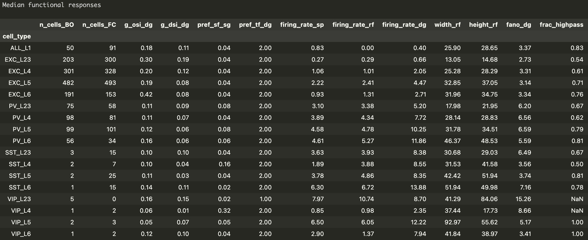

# V1 functional property table (version 1.4)

Functional properties of different cell types in the primary visual cortex (V1) derived from the Allen Institute extracellular electrophysiology (Neuropixels) data

Please look at 'cortical_metric_table.ipynb' to see how the table is generated.

## Example table (median)



n_cells_BO: Number of cells in 'Brain Observatory' sessions

n_cells_FC: Number of cells in 'Functional Connectivity' sessions

g_osi_dg: Global OSI (orientation selectivity index) for drifting gratings

g_dsi_dg: Global DSI (direction selectivity index) for drifting gratings

pref_sf_sg: Preferred spatial frequency for static gratings (cycles / °)

pref_tf_dg: Preferred temporal frequency for drifting gratings (Hz)

firing_rate_sp: Population average of the firing rates during the first spontaneous activity segment in the session that is longer than 200 s. (Hz)

firing_rate_rf: Population average of the firing rates during the entire duration of the Gabor patch stimulus (receptive field measurement) (Hz)

firing_rate_dg: Population average of the firing rates during the entire duration of the drifting gratings stimulus (Hz)

width_rf: Horizontal width of the receptive field (°)

height_rf: Vertical height of the receptive field (°)

fano_dg: Fano factor for a preferred pattern of drifting gratings

frac_highpass: fraction of cells that prefer high-contrast stimulus

## Methods

The cells were categorized by the cortical layer, waveforms and opto-taggings.

The layer information is taken from the repository of Neuropixels platform paper
(<https://github.com/AllenInstitute/neuropixels_platform_paper/tree/c29e59abedebe5f1f4f20739fe02c95f29d4556d>)

The neurons' waveforms were separated into broad spikes and narrow spikes (using
the waveform on the maximum amplitude channel; PCA + Mixture of Gaussians clustering).
Waveform analysis was done only for neurons that pass the default quality control (QC) tests (see here for details <https://allensdk.readthedocs.io/en/latest/_static/examples/nb/ecephys_quality_metrics.html>)
Neurons with broad spikes without opto-tagging were considered as excitatory neurons.
Neurons with narrow spikes without opto-tagging were considered as PV neurons.

When the neurons were opto-tagged, they were classified accordingly to the type of
the cre-line (PV, SST, VIP). When the neurons are opto-tagged, we do not use waveform to assign a cell type. (Therefore, we may be including some neurons that do not pass the default QC tests.)
Because SST and VIP cells were small populations, we used both V1 and non-V1 opto-tagged
neurons. PV and excitatory neurons were exclusively from V1.

The table shown here is ony a small subset of availble features. For full feature set,
please run the notebook and edit features to extract. Detailed descriptions of the data
are available at ECEphys website (<https://allensdk.readthedocs.io/en/latest/visual_coding_neuropixels.html>).

Width and weight that exceed 100° are ignored because they may be of the neurons
without a clear receptive field.

Contrast response analysis is done similarly to the one introduced in
Millman et al., eLife 2020 (<https://elifesciences.org/articles/55130>). Namely, the
responses to contrast was fit with 3 different models (rising sigmoid (high-pass),
falling sigmoid (low-pass), and a product of rising and falling sigmoids (band-pass)) and used
Akaike Information Criterion (AIC) to determine which model best explains the response.

The code used for the above analysis are also included in the 'misc' folder, but they are
not particularly well-documented (reference only). Please contact me for clarifications.

---

## Generating OSI/DSI Neuropixels v4 tables

The v4 tables provide per-neuron orientation/direction selectivity indices
(OSI/DSI), firing rates, and cell-type labels for V1 and LM, combining data
from Brain Observatory (BO) and Functional Connectivity (FC) sessions.

Three output files are produced:

| File | Area | Description |
|------|------|-------------|
| `OSI_DSI_neuropixels_v4.csv` | V1 (VISp) | Primary visual cortex |
| `OSI_DSI_neuropixels_V1_v4.csv` | V1 (VISp) | Same as above (explicit name) |
| `OSI_DSI_neuropixels_LM_v4.csv` | LM (VISl) | Lateromedial visual area |

### Pipeline overview

```
cortical_metrics_1.4.csv
        │
        ├──► misc/convert_to_metrics.py --area VISp ──► OSI_DSI_neuropixels_v3.csv  (V1 v3)
        │                                                │
        │                                                ├──► misc/merge_fc_with_cell_types.py
        │                                                │        (+ functional_connectivity_2Hz.csv)
        │                                                │        ──► functional_connectivity_2Hz_with_cell_types.csv
        │                                                │
        │                                                └──► misc/combine_osi_dsi_analysis.py --area VISp
        │                                                          ──► OSI_DSI_neuropixels_v4.csv
        │                                                          ──► OSI_DSI_neuropixels_V1_v4.csv
        │
        └──► misc/convert_to_metrics.py --area VISl ──► OSI_DSI_neuropixels_LM_v3.csv  (LM v3)
                                                         │
                                                         └──► misc/combine_osi_dsi_analysis.py --area VISl
                                                                   ──► OSI_DSI_neuropixels_LM_v4.csv
```

### Environment setup

```bash
conda env create -f environment.yml
conda activate neuropixels_osi_dsi
```

The pipeline requires only **Python ≥ 3.8**, **pandas**, and **numpy**.

### Required input files

| File | Included in repo? | How it was generated |
|------|-------------------|----------------------|
| `cortical_metrics_1.4.csv` | **Yes** | [`misc/generate_cortical_metrics.py`](misc/generate_cortical_metrics.py) (see [Upstream data](#upstream-data-provenance)) |
| `functional_connectivity_2Hz.csv` | **Yes** | Extracted from Allen Institute Neuropixels FC sessions (see [Upstream data](#upstream-data-provenance)) |

> **Note:** For the FC dataset, because the presented gratings were 4 directions instead of 8 directions, only firing rate statistics were taken, not direction/orientation selectivity measures.

### Reproducing the results

Both input files are included in this repository. From the repository root, run:

```bash
bash run_pipeline.sh
```

This executes the following steps automatically:

**Step 1 — Build V1 v3 table**

```bash
python misc/convert_to_metrics.py \
    --area VISp \
    --metrics cortical_metrics_1.4.csv \
    --output OSI_DSI_neuropixels_v3.csv
```

Reads `cortical_metrics_1.4.csv` (via [`misc/convert_to_metrics.py`](misc/convert_to_metrics.py)), keeps SST/VIP from all visual cortical areas
and Exc/PV from VISp only, applies quality-control filters
(`presence_ratio > 0.9`, `amplitude_cutoff < 0.1`, `isi_violations < 0.5`),
converts compact cell-type codes (e.g. `EXC_L23`) to human-readable labels
(e.g. `L2/3 Exc`), and writes a space-delimited CSV.

**Step 2 — Build LM v3 table**

```bash
python misc/convert_to_metrics.py \
    --area VISl \
    --metrics cortical_metrics_1.4.csv \
    --output OSI_DSI_neuropixels_LM_v3.csv
```

Same procedure as Step 1 but restricts Exc/PV to VISl (area LM).

**Step 3 — Merge FC data with cell types**

```bash
python misc/merge_fc_with_cell_types.py
```

Runs [`misc/merge_fc_with_cell_types.py`](misc/merge_fc_with_cell_types.py),
which reads `functional_connectivity_2Hz.csv` and the V1 v3 table
(`OSI_DSI_neuropixels_v3.csv`). Performs a left join on unit ID to attach
cell-type labels, derives convenience boolean columns (`is_sst`, `is_pv`,
`is_exc`, etc.), and writes
`functional_connectivity_2Hz_with_cell_types.csv`.

**Step 4 — Build V1 v4 table**

```bash
python misc/combine_osi_dsi_analysis.py \
    --v3  OSI_DSI_neuropixels_v3.csv \
    --fc  functional_connectivity_2Hz_with_cell_types.csv \
    --out OSI_DSI_neuropixels_v4.csv \
    --area VISp
```

Runs [`misc/combine_osi_dsi_analysis.py`](misc/combine_osi_dsi_analysis.py).
Updates v3 firing rates with FC values for matching neurons.  Appends
FC-only neurons in VISp that are not in the v3 table, back-filling their
cell types from `cortical_metrics_1.4.csv`.  Attaches `firing_rate_ns`
(natural-scenes firing rate) from the same metrics file.  Drops rows
without a valid cell type.

**Step 5 — Copy to V1-explicit name**

```bash
cp OSI_DSI_neuropixels_v4.csv OSI_DSI_neuropixels_V1_v4.csv
```

**Step 6 — Build LM v4 table**

```bash
python misc/combine_osi_dsi_analysis.py \
    --v3  OSI_DSI_neuropixels_LM_v3.csv \
    --fc  functional_connectivity_2Hz_with_cell_types.csv \
    --out OSI_DSI_neuropixels_LM_v4.csv \
    --area VISl
```

Same procedure as Step 4 but for area LM (VISl).

### Output file format

- **Delimiter:** space (` `)
- **Quoting:** fields containing spaces (e.g. `"L6 Exc"`) are double-quoted (`csv.QUOTE_MINIMAL`)
- **Header:** first row contains column names
- **Index:** `ecephys_unit_id` (first column)
- **Missing values:** `NaN`

Columns in the v4 tables:

| Column | Description |
|--------|-------------|
| `ecephys_unit_id` | Unique neuron identifier (index) |
| `DSI` | Direction selectivity index |
| `OSI` | Orientation selectivity index |
| `preferred_angle` | Preferred direction (degrees) |
| `max_mean_rate(Hz)` | Maximum mean firing rate across orientations |
| `Ave_Rate(Hz)` | Average firing rate across all orientations |
| `cell_type` | Cell-type label (e.g. `L4 Exc`, `L5 PV`, `L2/3 SST`) |
| `Spont_Rate(Hz)` | Spontaneous firing rate |
| `firing_rate_ns` | Natural-scenes firing rate (from cortical metrics) |

### Upstream data provenance

The two required input files are themselves derived from the
[Allen Institute Neuropixels Visual Coding dataset](https://allensdk.readthedocs.io/en/latest/visual_coding_neuropixels.html).
Generating them requires the **Allen SDK** and a local copy of the Neuropixels
data cache (~100 GB).

#### `cortical_metrics_1.4.csv`

Produced by `misc/generate_cortical_metrics.py`, which merges:

1. `all_metrics_resourcetable.csv` — unit-level analysis metrics from both BO
   and FC sessions, with waveform classification and opto-tagging added by
   `misc/make_resource_table.py`
2. `contrast_analysis.csv` — contrast-tuning model fits
   (`misc/contrast_tuning.py`)
3. `last_spontaneous_rate2.csv` — spontaneous firing rates
4. `drifting_gratings_2Hz.csv` — 2 Hz drifting-grating response metrics
   (`misc/drifting_gratings_2Hz.py`)

See `cortical_metric_table.ipynb` in this repository for an interactive
walkthrough of how `cortical_metrics_1.4.csv` is assembled and summarised.

#### `functional_connectivity_2Hz.csv`

Produced by extracting firing-rate statistics from the FC session type
(drifting gratings at 2 Hz temporal frequency, 0.8 contrast, 75 repeats)
for all visual-cortex neurons.  Each FC session is processed independently
(spike counts in 0–2 s stimulus windows, significance via quasi-Poisson test)
and the per-session results are concatenated.

The extraction script (`functional_connectivity_2Hz.py`, kept in the
development directory) requires:
```python
from allensdk.brain_observatory.ecephys.ecephys_project_cache import EcephysProjectCache
```
and a local manifest pointing to the downloaded Neuropixels cache.
